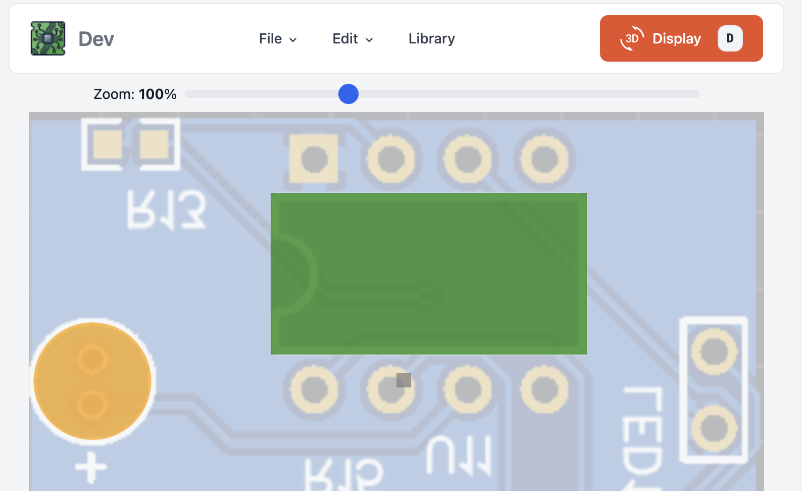
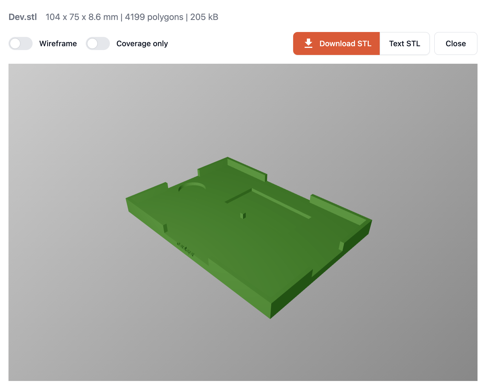
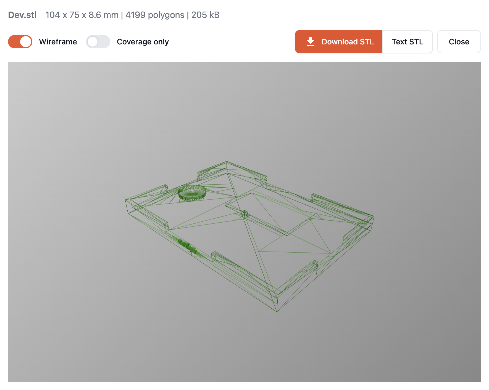

# PCB THT holder

[Changelog](CHANGELOG.md)

3D STL file generator for THT PCB panels, online access: https://segmentcontroller.github.io/pcb-tht-holder/

I make almost all of my printed circuit boards with online design software and entrust the manufacturing company to install the SMD components. I install the THT (through hole technology) components at home for two reasons:

- What they charge for meticulous manual work cannot be called cheap.
- Not all THT parts are needed, in many cases only 2 of the 6 relays are installed. This can reduce costs.

> I would also like to do the THT installation at home nicely. However, with many panels there are "traces of haste".

## That's why I created an **online tool** that:

- Based on the photo of the PCB, it helps to leave the place of the protruding (THT) parts empty.
- It creates a 3D format (STL) output that, if you print, will keep the parts straight during soldering.
- It can work without registration and without uploading (and storing) a photo of the PCB.

In its current state, it facilitates the installation of circular and oblong components. This is sufficient in the following cases: **relays, capacitors, resistors, terminals and pin-headers.** It automatically calculates the required area and volume based on the height of the parts. But it doesn't mean that there aren't any mistakes in it: if you experience anything, I welcome your comments.

## Features

- **Component Shapes**: Support for circular and rectangular components
  - Rectangles support full 360° rotation (0-359 degrees)
  - Flip dimensions to swap width/height instantly
- **Alignment Guides with Magnetic Snapping**: Visual guides and automatic snapping for precise component placement
  - Blue lines appear when elements align with centers or edges of other components
  - Elements automatically snap within 0.2mm of alignment points during drag
  - Toggle on/off via Align switch in navigation bar
  - Works on both X and Y axes independently for accurate positioning
- **Smart Leg Placement**: Automatic collision detection for support legs
  - Legs overlapping with components are automatically filtered during mesh generation
  - Warning notification shows count of hidden legs
  - Prevents mesh generation errors and ensures clean STL output
- **Print Tolerance**: Adjustable tolerance setting (0-2mm with 0.1mm precision)
  - Compensates for 3D printer dimensional inaccuracies
  - Enlarges component holes and shrinks holder panel for perfect fit
- **Responsive Mesh Generation**: Real-time progress tracking during 3D mesh generation
  - Async generation prevents UI freezing with 100+ components
  - Progress bar shows percentage and visual indicator
  - UI remains responsive throughout the generation process
- **Measurement Tool**: Press `M` to measure distances in 1/10th millimeter precision
- **Comprehensive Undo System**: Press `Ctrl+Z` to undo operations (max 50 actions)
  - Component deletions (circles, rectangles, legs)
  - Property modifications (radius, depth, width, height, rotation)
  - Rectangle rotation (`R` key) and dimension flip (`F` key)
  - Visual error notifications for failed undo operations
  - Automatic stack clearing on project reset
- **Component Library**: Save and reuse your favorite component configurations
  - Pre-defined library with 14 common THT components (DIP sockets, capacitors, buzzers, terminals, relays)
  - One-click loading of standard footprints with datasheet-sourced dimensions
  - Import/export library as JSON for backup or sharing
  - Clear library with confirmation for fresh start
- **Keyboard Shortcuts**: Extensive keyboard shortcuts for efficient workflow
- **Hover Info**: Real-time element information and available shortcuts when hovering
- **Hollow Option**: Generate top-layer-only coverage for faster printing
- **Custom Labels**: Print text labels on the side of your holder
- **Auto Image Resize**: Automatically resizes large images (>1280x1024) for easier handling
- **PWA Support**: Install as a standalone application on your device
- **Offline Ready**: Works without internet connection after first load

## Keyboard Shortcuts

### Mode Selection

- `P` - Pointer mode (select and move elements)
- `M` - Measure mode (measure distances on PCB)

### Creating Elements

- `Shift+C` - Add new circle
- `Shift+R` - Add new rectangle
- `Shift+L` - Add new support leg

### Editing Elements (when element is selected)

- **Movement**:
  - `Arrow keys` - Fine move 0.1mm
  - `Shift+Arrow keys` - Move 0.5mm (5x faster)
- **Rectangle Rotation**:
  - `R` - Rotate +5°
  - `Shift+R` - Reset rotation to 0°
  - `F` - Flip dimensions (swap width/height)
- **Context Menu**: Right-click on any element

### Other

- `Ctrl+Z` / `Cmd+Z` - Undo last operation (deletions, property edits, rotations, flips)
- `Shift+P` - Project settings
- `D` - Display 3D mesh
- `ESC` - Close modal dialogs
- `Double-click` - Edit element properties

## Try your first PCB to STL

Click here: https://segmentcontroller.github.io/pcb-tht-holder/

### Set up a PCB image

Enter a PCB image with drag and drop or file selection, which will automatically flip and become transparent.


### Place the components

Place the THT parts by placing circles or squares. Adjust their height/depth exactly so that they are flush with the PCB. At the end, if necessary, add legs to support the PCB.



### Generate a 3D design in STL format

Click the Display 3D button and see the generated mesh. Rotate it, check that all components are in place. At the end, download the STL file in binary format. (It is also possible to download a text STL file for debug purposes).



### Check as a wireframe if necessary

If you want to analyze the location of the components, you can also see how things fit in the wireframe view.



### Print it with a 3D printer...

Use a PLA printer to save time and money. Practice shows that it is enough to produce the STL file once, of which 1-3 prints are enough to implant hundreds of PCBs.

## Development

### Tech Stack

- **Framework**: Svelte 5 with TypeScript
- **Build Tool**: Vite
- **3D Rendering**: Three.js with @threlte/core
- **3D Operations**: three-bvh-csg for CSG boolean operations
- **2D Canvas**: Konva.js for component placement
- **UI**: Flowbite Svelte with Tailwind CSS 4
- **State**: svelte-persisted-store for local storage

### Requirements

- Node.js >= 24.0.0
- npm >= 11.0.0

### Local Development

```bash
# Install dependencies
npm install

# Start development server (accessible on network)
npm run dev

# Run type checking
npm run ts:check

# Run linting
npm run lint:check

# Format code
npm run format:fix

# Build for production
npm run build

# Run all checks and build
npm run all
```

### Project Structure

- `src/` - Source code
  - `components/` - Svelte components
  - `lib/` - Utility functions and 3D generation logic
  - `stores/` - Svelte stores for state management
  - `types/` - TypeScript type definitions
- `public/` - Static assets
- `docs/` - Production build output (GitHub Pages)

### Contributing

See [CHANGELOG.md](CHANGELOG.md) for recent changes and version history.
